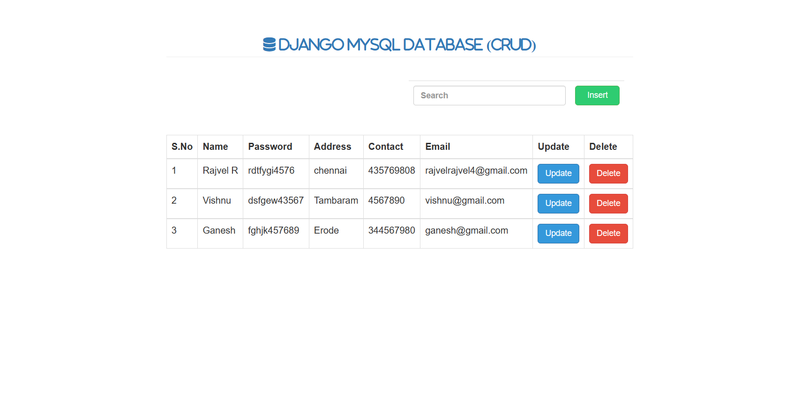
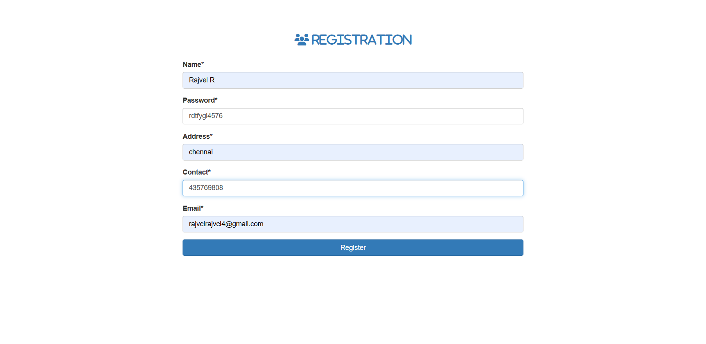
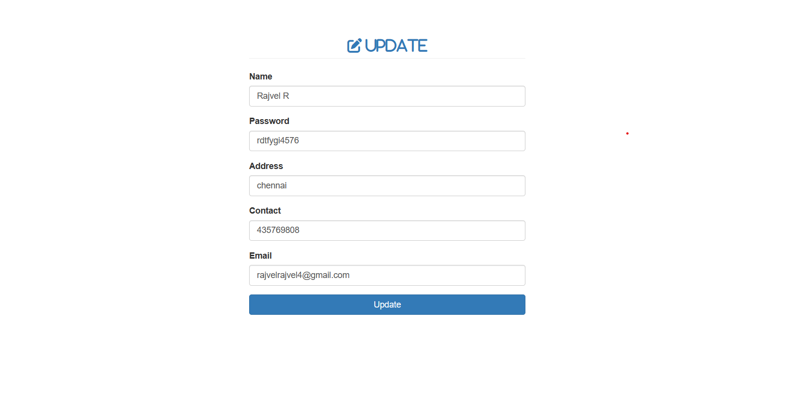

# Django CRUD Operations Project 🌐

This project demonstrates basic CRUD (Create, Read, Update, Delete) operations using Django framework.

## Output Screenshots
1. **Home Page**
    

2. **Insert Data**
    

3. **Update Data**
    


## Table of Contents
- [Overview](#overview)
- [Features](#features)
- [Setup](#setup)
- [Usage](#usage)
- [Output Screenshots](#output-screenshots)
- [License](#license)

## Overview
This Django project provides a simple web application for managing student records. It includes functionality for adding, updating, and deleting student details.

## Features
- User-friendly interface 🖥️
- CRUD operations for managing student records ✏️📚
- Form validation for data entry ✅
- Feedback messages for successful and unsuccessful operations 📢

## Setup
1. Clone the repository:
    ```bash
    git clone https://github.com/your-username/your-django-crud-project.git
    cd your-django-crud-project
    ```

2. Install dependencies:
    ```bash
    pip install -r requirements.txt
    ```

3. Apply database migrations:
    ```bash
    python manage.py migrate
    ```

4. Run the development server:
    ```bash
    python manage.py runserver
    ```

5. Access the application at `http://127.0.0.1:8000/` in your web browser.

## Usage
- Navigate to the home page to view existing student records.
- Use the "Register" link to add new student records.
- Click on the "Update" link next to a student record to modify the details.
- Press the "Delete" link to remove a student record.

## License
This project is licensed under the MIT License - see the [LICENSE](LICENSE) file for details.
